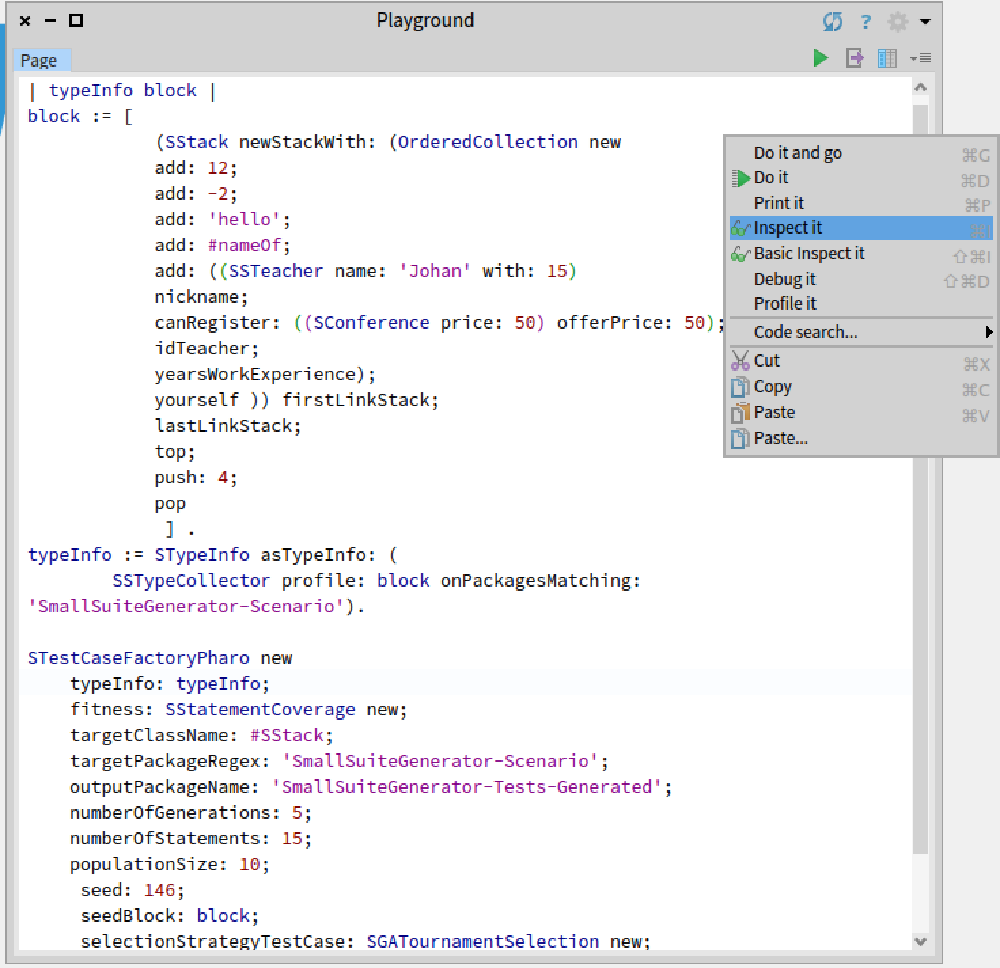

# EvoViz: Visual Introspection for Genetically-Based Test Coverage Evolution

Repository contains the artifacts to replicate experiments in the paper "EvoViz: Visual Introspection for Genetically-Based Test Coverage Evolution"

# SmallSuiteGenerator and EvoViz examples

To visualize EvoViz examples (of paper) execute the following commands on Terminal where the project was downloaded.

**MacOSX.**

```
./Pharo-OSX/Pharo.app/Contents/MacOS/Pharo Pharo9_330.image
```

**Linux.** Experiments were made on a Mac Book Pro and Debian distribution. If you have another distribution of Linux it is possible you could have some bugs.

```
./Pharo-Linux/pharo-ui Pharo9_330.image
```

**Windows.**
You may also run the experiment in Windows, but depending on the windows version you have installed it may be some some UI bugs.

```
cd Pharo-Windows
Pharo.exe ../Pharo9_330.image
```

**Open the Visualization.**
Select the code that appears on window, right click on window and select "Inspect". According the OS you also can press: Command + I (MacOS) or Ctrl + I (Linux and Windows).


