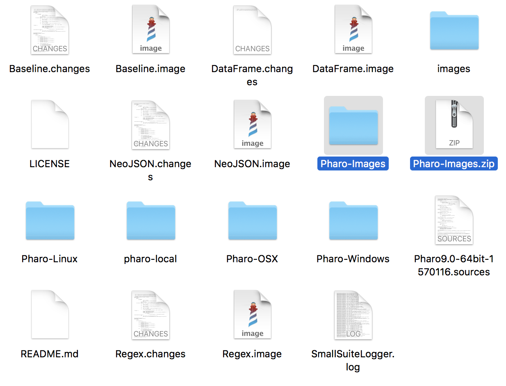

# EvoViz: Visual Introspection for Genetically-Based Test Coverage Evolution

This repository contains the artifacts to replicate experiments of paper: "EvoViz: Visual Introspection for Genetically-Based Test Coverage Evolution".

## Pharo images

After of downloading repository, uncompress Pharo-Images.zip file (it contains Pharo images to execute experiments). Copy all the files of Pharo-Images folder at ArtifactSSG folder (folder of repository).



You can remove Pharo-Images.zip and Pharo-Images folder.

## SmallSuiteGenerator and EvoViz examples

To visualize EvoViz examples (of paper) follow next commands on Terminal where the project was downloaded. 

**Hint** We do all experiments on Mac Book Pro and Linux (Debian Stretch), both of 64-bits. For that reason it is necessary you execute commands on 64-bits Operating System. Another way you commands will give error.

### Open Pharo image

First open the Pharo image.

**MacOSX.** 

```
./Pharo-OSX/Pharo.app/Contents/MacOS/Pharo Pharo.image
```

**Linux.** If you have another distribution of Linux it is possible you could have some bugs.

```
./Pharo-Linux/pharo-ui Pharo.image
```

**Windows.** Experiments were tested on Windows 10 (64-bits). Depending on the Windows version you have installed it may be some some UI bugs.

```
cd Pharo-Windows
Pharo.exe ..\Pharo.image
```

### Open the Visualization

Execute the code using the green play button (at the top right of the window). Another option is selecting all the code with `Ctrl + A` (`Command + A` for MacOS), right click on window and select "Inspect Code" option or press `Ctrl + I` (`Command + I` for MacOS). 


After doing that will appear a window where you need to write your name (Is is part of Pharo).
If the visualization window is very tiny or small you can extend it (like image). Furthermore, there are options to zoom in or zoom out the visualization.


## Experiment

For replicating the experiments shown in the paper:
  1. Open the image Pharo (described below)
  2. Execute the code of the window that appears in the image (using the green play button or Inspect command, described before).

### DataFrame 

DataFrame image contains three scripts to execute.

**MacOS**
```
./Pharo-OSX/Pharo.app/Contents/MacOS/Pharo DataFrame.image
```
**Linux**
```
./Pharo-Linux/pharo-ui DataFrame.image
```
**Windows**
```
cd Pharo-Windows
Pharo.exe ..\DataFrame.image
```

### NeoJSON

In the same way NeoJSON image contains three examples to execute.

***MacOS***
```
./Pharo-OSX/Pharo.app/Contents/MacOS/Pharo NeoJSON.image
```
***Linux***
```
./Pharo-Linux/pharo-ui NeoJSON.image
```
***Windows***
```
cd Pharo-Windows
Pharo.exe ..\NeoJSON.image
```

### Baseline

It contains three scripts of SStack, DataFrame and NeoJSON where you can change some values to test. Values to changes: 
 - `numberOfIterations:`. You can change for any integer positive number greter than 1.
 - `numberOfStatements:`. Any integer positive number greater than 1
 - `populationSize:`. Usually a number greater than 1
 - `seed:`. Any number but 0.
 - `selectionStrategy:`. SGATournamentSelection, SGARankingSelection

***MacOS***
```
./Pharo-OSX/Pharo.app/Contents/MacOS/Pharo Baseline.image
```
***Linux***
```
./Pharo-Linux/pharo-ui Baseline.image
```
***Windows***
```
cd Pharo-Windows
Pharo.exe ..\Baseline.image
```
